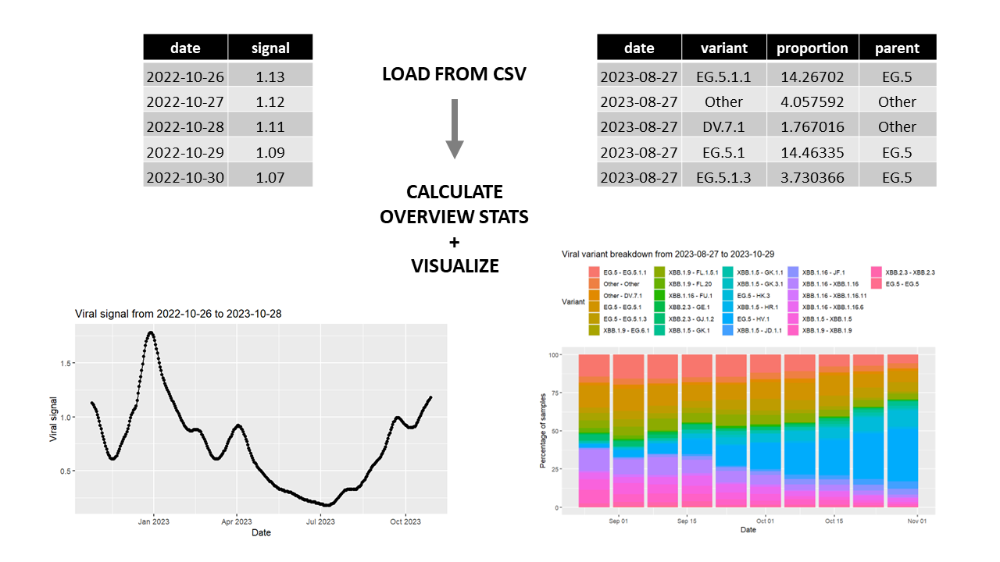

<!-- README.md is generated from README.Rmd. Please edit that file -->

```{r, include = FALSE}
knitr::opts_chunk$set(
  collapse = TRUE,
  comment = "#>",
  fig.path = "man/figures/README-",
  out.width = "100%"
)
```

# CovidWasteWatch

<!-- badges: start -->
<!-- badges: end -->


## Description

`CovidWasteWatch` is an R package for analysis and visualization
of COVID-19 wastewater viral signal and variant frequency data. 
Using user-provided pre-processed data, this package aims to provide users 
with various statistical backgrounds a simple and efficient way to observe 
trends in COVID-19 viral signal levels and variant frequencies over time.
`CovidWasteWatch` was developed using `R version 4.3.1 (2023-06-16 ucrt)`, 
`Platform: x86_64-w64-mingw32/x64 (64-bit)`, and 
`Running under: Windows 11 x64 (build 22621)`.

## Installation

To install the latest version of the package:

``` r
require("devtools")
devtools::install github("viv-wang/CovidWasteWatch", build vignettes = TRUE)
library("CovidWasteWatch")
```

To run the shinyApp:
Under construction

## Overview

To see an overview of the package:

``` r
ls("package:CovidWasteWatch")
data(package = "CovidWasteWatch")
browseVignettes("CovidWasteWatch") 
```

`CovidWasteWatch` provides 4 functions:

- `ViralSignal()` loads and extracts relevant data from a CSV file containing
COVID-19 viral signal data over time, producing a statistical and graphical
(line plot) overview of the data.
- `VarBreakdown()` loads and extracts relevant data from a CSV file containing
COVID-19 viral variant proportion data over time, producing a statistical and graphical
(stacked bar plot) overview of the data.
- `PlotViralSignal()` plots viral signal data from a given dataframe as a line 
plot, with dots as markers for each data point.
- `PlotVarBreakdown()` plots viral variant breakdown data from a given dataframe
as a stacked bar plot, where each stacked bar represents the variant
breakdown at one time point.

For a tutorial demonstrating these functions, please see the vignettes.
The package also contains two sample datasets, one for each COVID-19 data type, 
which are described in the data documentation and the introductory vignette.

An overview of `CovidWasteWatch` is illustrated below.



## Contributions

The author of this package is Vivian Wang, who wrote the four functions.
The data overview functions `ViralSignal()` and `VarBreakdown()` use`R.utils` to 
read the input CSV files, and `dplyr` to arrange the loaded datasets.
The plotting functions `PlotViralSignal()` and `PlotVarBreakdown()` utilize 
`ggplot2` to create graphical output from the processed data.

## References

Bengtsson, H (2022). R.utils: Various Programming Utilities. https://henrikbengtsson.github.io/R.utils/

R Core Team (2023). R: A language and environment for statistical computing. R Foundation for Statistical Computing, Vienna, Austria. https://www.R-project.org/

Silva, A. (2022) TestingPackage: An Example R Package For BCB410H.
Unpublished. URL https://github.com/anjalisilva/TestingPackage

Wickham, H. (2016). ggplot2: Elegant Graphics for Data Analysis. Springer-Verlag New York. ISBN 978-3-319-24277-4. https://ggplot2.tidyverse.org

Wickham H, François R, Henry L, Müller K, Vaughan D. (2023). dplyr: A Grammar of Data Manipulation. https://dplyr.tidyverse.org


## Acknowledgements

This package was developed as part of an assessment for 2023
BCB410H: Applied Bioinformatics course at the University of
Toronto, Toronto, CANADA. CovidWasteWatch welcomes issues,
enhancement requests, and other contributions. To submit an issue,
use the GitHub issues.
